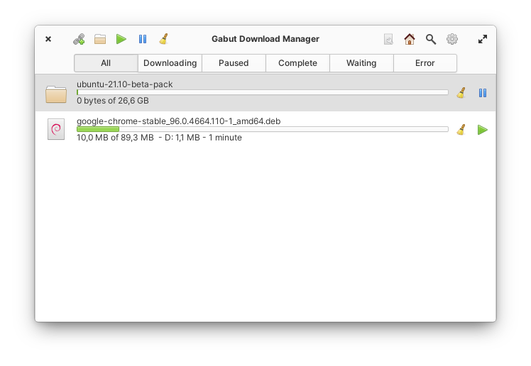
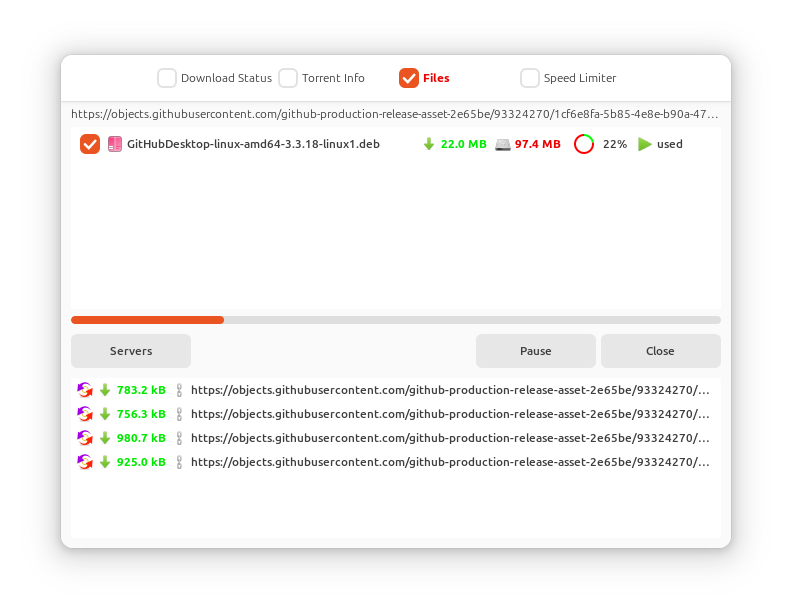
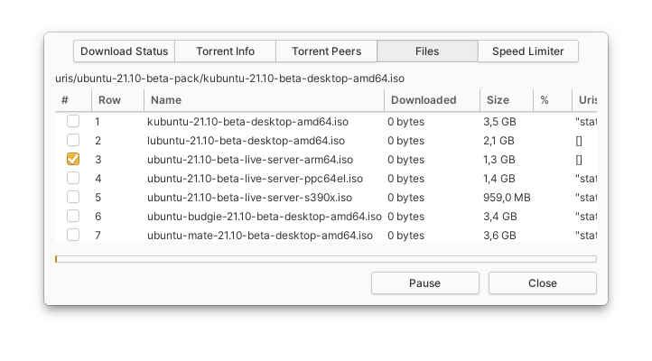
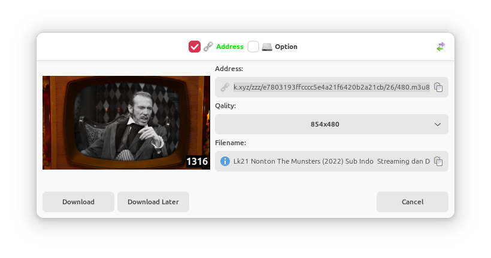
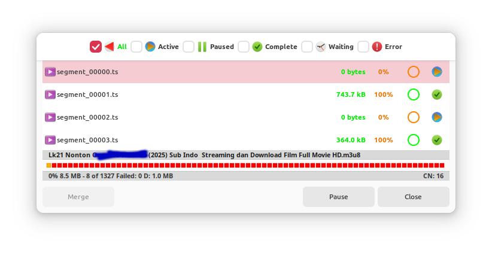
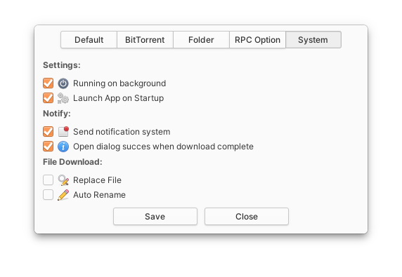

<h1 align="center">Gabut Download Manager</h1>
<h1 align="center">
     
    
</h1>
<h4 align="center">Simple and Faster Download Manager</h4>

    
    

<h1 align="center">Release on</h1>

    
    
    

Gabut Download Manager a application that can download metallink magnetlink torrents using Aria2c and an application that has a local server service interface, can also accept file transfers from smartphones.

Made with love and sleep deprivation. :D

## Preview

## Build with meson:

## Dependencies:

* aria2c
* meson
* glib-2.0
* gtk+-3.0
* sqlite3
* libcanberra
* gdk-x11-3.0
* xtst
* x11
* libsoup-2.4
* gee-0.8
* json-glib-1.0
* libqrencode
* gdk-pixbuf-2.0
* cairo

Install `Dependency`  with command

    sudo apt install aria2c meson debhelper valac libgtk-3-dev libsqlite3-dev libcanberra-dev libxtst-dev libx11-dev libsoup2.4-dev libgee-0.8-dev libjson-glib-dev libqrencode-dev libgdk-pixbuf2.0-dev libcairo2-dev

Run `meson` to configure the build environment and then `ninja` to build and run automated tests

    meson build --prefix=/usr
    cd build
    ninja

To install, use `ninja install`

    sudo ninja install

Then execute with `com.github.gabutakut.gabutdm`

## Repository

key server

    sudo apt-key adv --keyserver keyserver.ubuntu.com --recv-keys 2B067CC53533F081B664BF72F6CBED8742796C8E

add repo with Simple method

    sudo sh -c 'echo "deb http://ppa.launchpad.net/torik-habib/bionic/ubuntu bionic main" > /etc/apt/sources.list.d/gabutdm.list'
    sudo apt-get update

or With `add-apt-repository`

    sudo add-apt-repository ppa:torik-habib/gabutdm
    sudo apt-get update

Repo intall

    sudo apt install com.github.gabutakut.gabutdm
